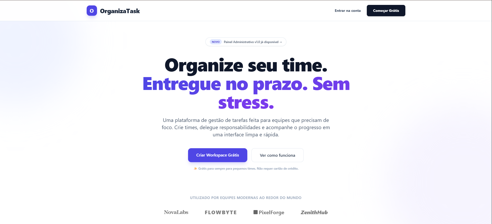

# 🎨 OrganizaTask-frontend

<!-- Badges de Tecnologia e Status -->

  
<i>Interface responsiva e intuitiva para o projeto Task Manager.</i>

> Uma aplicação frontend moderna focada em facilitar a organização, criação e gestão de tarefas diárias. Desenvolvida com foco em performance, fluidez e acessibilidade para o usuário.

## 💻 Pré-requisitos

Antes de começar, verifique se você possui:

* **Ambiente:** Node.js (versão LTS).
* **Gerenciador de Pacotes:** NPM ou Yarn.
* **Ferramentas:** VS Code com extensões recomendadas (ESLint/Prettier).
* **Conexão:** Acesso à API do backend (OrganizaTask-API) rodando localmente ou em staging.

## 🛠️ Stack Tecnológica

O projeto utiliza o que há de mais moderno no ecossistema de desenvolvimento de interfaces:

* **Core:** React.js (com Vite).
* **Estilização:** CSS / Tailwind CSS 
* **Gerenciamento de Estado:** Context API / Hooks customizados.
* **Consumo de API:** Axios ou Fetch API.

## 🚀 Como Iniciar

**1. Clone e Instalação:**

git clone [https://github.com/leonard0antonio/OrganizaTask-frontend.git](https://github.com/leonard0antonio/OrganizaTask-frontend.git)
cd OrganizaTask-frontend
npm install

**2. Configuração de Variáveis de Ambiente:**
Crie um arquivo `.env` na raiz do projeto e adicione a URL da sua API de tarefas:

VITE_API_URL=http://localhost:3000

**3. Execução:**

npm run dev

## 📱 Visualização e Responsividade

Este projeto foi testado e otimizado para:

* [x] Navegadores Web (Chrome, Edge, Firefox).
* [x] Dispositivos Mobile (Android e iOS).
* [x] Tablets e diferentes resoluções de tela.

## 📫 Contribuindo

Para contribuir com melhorias de UI ou correções de componentes:

1. Faça o Fork do projeto.
2. Crie uma branch para sua melhoria visual: `git checkout -b style/ajuste-componente`.
3. Siga o padrão de **Conventional Commits**: `git commit -m 'style(ui): ajusta padding e cores do card de tarefa'`.
4. Envie o Pull Request.

## 🤝 Colaboradores

<table>
  <tr>
    <td align="center">
      <a href="https://github.com/leonard0antonio" title="Leonardo Antonio">
         
        
          <b>Leonardo Antonio</b>
        
      </a>
    </td>
  </tr>
</table>

## 📝 Licença

Este projeto está sob a licença **Apache License 2.0**.

Copyright 2026 © Leonardo Antonio

Você não pode usar este arquivo exceto em conformidade com a Licença. Você pode obter uma cópia da Licença em: http://www.apache.org/licenses/LICENSE-2.0. Consulte o arquivo `LICENSE` no repositório para mais informações.
